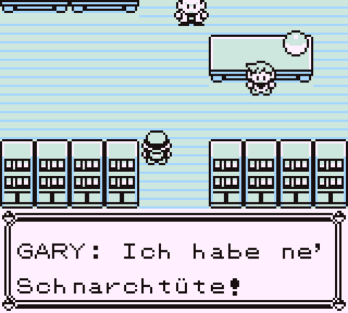
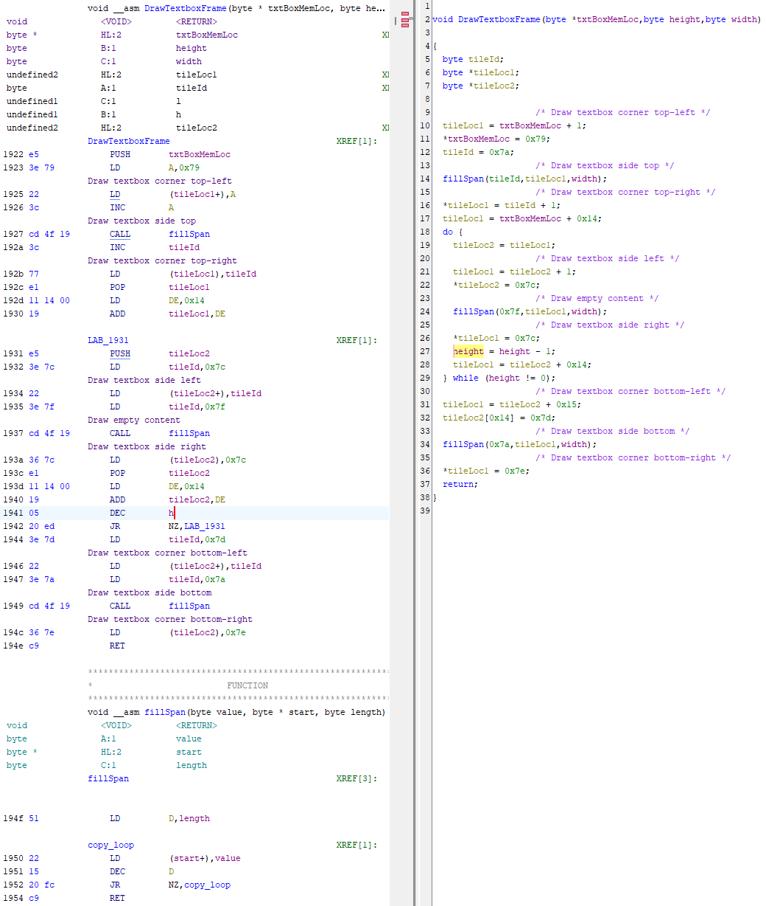

Originally, the topic of this month was "Retro reverse engineering". I wanted to learn something
about how the Generation 1 Pokémon games work. The plan changed halfway through and I ended up
making a rom hack for Pokémon Red/Blue that aims to fix some of its glitches.

# An emulator for debugging

I didn't expect this part to be difficult. There are a lot of Game Boy emulators out there, and I
just expected them to have good debuggers.

That wasn't really the case. It doesn't help that I'm stuck on macOS on my main PC.

The first result I found was [BGB](https://bgb.bircd.org). It has a pretty good debugger, but it's
windows only (It's supposed to run under wine, I didn't try that). But it's still what I used for
the first few days on my windows laptop. Strangely when using it over remote desktop, the graphics
can't be seen. And when using AnyDesk, the graphics work, but the arrow keys don't. So I had to
switch computers for this.

Later on, I found [Emulicious](https://emulicious.net). It's got an even better debugger, VS Code
integration, and is written in java, so it's cross-platform.

# Actual reverse engineering

## Custom dialog

First, I tried to actually understand the assembly code of the Pokémon games. Using tools like tile
map visualization and ram watches, I found out how the dialog system in Pokémon Red works, at least
graphically.

The Game Boy has two tilemaps. Let's call them A and B. The actual overworld always seems to be on
map A. When the player initiates a dialog, all tiles at the current location are copied over to
map B, and the dialog is put on top.

I assume this is done so the game can just seamlessly return to gameplay after a dialog without
having to clean up the textbox tiles and reload the part of the map that the textbox covered.

Strangely any manual changes to tilemap B got immediately reversed. It appeared that the
dialog tilemap is copied over every frame from another memory location "C490".

Writing the text I want into that location, I was able to manipulate the dialog that is currently
displayed.

Interestingly, from what I've seen, both maps are actually always active. The Game Boy has a
"window", that can be used to display a section of another map at a given X Y offset. This is
typically used to display HUDs in games.

Pokémon instead uses it to display the tilemap B with the dialog above the tilemap A. Manually
moving the window shows the actual map still underneath it, making parts of the screen look
doubled.

## Cheating

import Cheating from './cheating.mp4';

Since a debugger gives us a lot of power, and power corrupts, I tried to cheat at the game next.

Using a memory search, I managed to find the memory location that contains the HP of the players
Pokémon. This process was similar to using cheat engine. You enter the value the HP currently
should have, and the search finds every ram address with a matching value. Then you either heal
or take damage, changing the HP value and search again in the remaining values. This pretty
quickly brings you to one or two variables that could be responsible.

By freezing this ram value, I was able to make my Pokémon mostly invulnerable. But there were
some strange effects because the value was still changed, it just immediately reset.

Then, I used a memory watchpoint to stop code execution when the HP value gets written to. Using
that, I found the code that applies the damage. Replacing the "SUB" in that function with a "NOP"
I could stop all damage from hitting my Pokémon.

<video controls src={Cheating} style="max-width: 100%;" aria-label="A Pokémon battle with a Charmander (Nicknamed 'Gloomi') battling against an enemy Squirtle. Despite the Squirtle attacking multiple times, it does no damage every time." loop muted />

## Decompilation
import './screenshot_inverter.css'

I know that Pokémon wasn't programmed in C, but I wanted to see if Ghidra would be able to give me
some insight into what's happening in the code.

I wanted to inject some custom text directly into the rom, so I tried to understand the routine
that reads text from rom. I managed to "decompile" two functions that are responsible for
displaying the borders of the textbox.

  
Ghidra screenshot

  

# Switching things up

At this point, I decided I wasn't making the kinds of progress I wanted. With my monthly projects,
I wanted to have something I could release every day. More importantly, I didn't feel comfortable
enough actually reading assembly to make any significant progress.

So I wanted to try something easier and work with the existing
[pokered](https://github.com/pret/pokered) disassembly. That way I could get more used to working
with assembly without jumping in on the deep end.

# Pokémon Boring Edition

So I started working on Pokémon Boring Edition. It's a mod of Pokémon Red/Blue, but with a lot of
the most interesting bugs fixed. What I've fixed is listed in the
[README](https://github.com/edave64/pokered-boring-edition/blob/master/README.md#fixed-bugs), so I
won't repeat it all here, but I'll go into some of the things I found interesting.

## Critical hit chance

It is
[well known](https://bulbapedia.bulbagarden.net/wiki/List_of_battle_glitches_in_Generation_I#Critical_hit_ratio_error)
that the move focus energy and the dire-hit item have a bug. They are supposed to quadruple the
critical hit chance of a move, but quarters it instead. Which makes them fairly useless.

What I didn't know before is that this is because they switched the direction of a bit shift. When a
focus boost is used, it's supposed to shift the hit change one to the left, otherwise one to the
right. But the shifts are done in the wrong directions.

That means the hit chance is actually always four times higher than it should be. And focus
boosting restores the originally intended critical hit chance.

Had I just flipped the direction of the shift, that would mess with the crit-chance players are
used to in these games. So instead, my fix always does a left shift, and then another one if
focus boosts are active, preserving the chances people are used to, while still making focus boost
work somewhat as intended.

[The fix](https://github.com/edave64/pokered-boring-edition/commit/53b725ae002eb49e4c2353451bf658e3e64f61c9?diff=split)

Curiously, they had a correct overflow check after the left shift, so they couldn't have been
completely oblivious to what they were doing.

## Trainer fly

One of the bugs that breaks the game is trainer fly. Essentially, there is one frame between the
player initiating fly/teleport or something else that quickly moves the player to another map
during which they can still be spotted by an NPC trainer.

The game changes the map script to one that makes the NPC walk towards the player and initiates
a battle, but then the player disappears and changes maps.

This allows the player to manipulate the data of the upcoming battle, then trigger it by moving
back to the map they escaped from, which resumes the map script and starts the battle.

I tried to make something that resets the map script when the player escapes, but I couldn't figure
out how they are actually set. So I checked the fix from the
[pokered wiki](https://github.com/pret/pokered/wiki/[ARCHIVED]-Bugs-and-Glitches#Fix-Trainer-Fly-Glitch)
, and they use a fairly heavy-handed approach.

Essentially, they use an unused bit in one of the flag variables to store "Is the player currently
prevented from battling a trainer?". This is always set to 1, except when the player is spotted by
an NPC. And if a battle is started with the flag active, the map script aborts. Changing maps by
any means sets the flag to 1.

It feels very paranoid, like the bug is the norm and an actual battle is the exception, but it works,
so I added it, even if that means it locks players out of obtaining mew. But I later flipped the
meaning of the bit, so it's an "Allow npc encounters" flag now, which seems a little more sensible
to me.

[The fix](https://github.com/edave64/pokered-boring-edition/commit/0fb81735e4986314431be8cd4d2666e56667142c?diff=split)

## Old man glitch

Also known as the [Missingno glitch](https://bulbapedia.bulbagarden.net/wiki/Old_man_glitch). This
is another bug that is often only just half explained, and the fix is very different to what might
be expected.

The "old man" in Viridian City teaches players how to catch Pokémon. He triggers a scripted battle
where the name of the player is temporarily changed to "Old Man". To reset the name later, the game
stores the player's name in the list of wild land Pokémon available in the current map.

Since players can't encounter wild Pokémon in towns, and the list gets reset when walking to a new
map, this would be odd by modern standards, but fine.

The bug occurs when the player flys to cinnabar island and surfs on the eastern shore. Suddenly,
they can encounter very strange Pokémon, like "Missingno." with glitched sprites, that can corrupt
hall of fame data who's "Pokémon seen"-flag intersects with the 128-place of the amount for the
sixth item in your inventory, giving a consistent way to multiply items.

It is often incorrectly said that the eastern shore of the island is incorrectly marked as encounter
tiles in the map data, which causes the issues, but it's not actually a problem with the island.
This happens on all eastern shore tiles. It would happen in Vermilion, too, except that has an
encounter rate of 0. The game doesn't have separate regions for what kind of Pokémon can be
encountered where. It just checks the tile the player is currently standing on. But tiles in Pokémon
are actually larger than the tiles of the Game Boy hardware.

Each game tile is made of 2x2 hardware tiles. When triggering an encounter, the game checks if the
bottom right tile the player is standing on is grass or water. If so, the encounter can happen.

import SeaShore from './sea_shore.png';

<svg viewBox="0 0 192 192" xmlns="http://www.w3.org/2000/svg" role="img" aria-labelledby="seashore_desc">
		<desc id="seashore_desc">
			A zoomed in screenshot of the game, with the tiles under the player highlighted.
		</desc>
    <image width="192" height="192" href={SeaShore.src} style="image-rendering: pixelated;" />
    <line x1="80" y1="112" x2="48" y2="144" stroke="red" strokeWidth="2" />
    <text width="1" height="1" x="20" y="154" stroke="white" strokeWidth="2" style="font-size: 12px; fill: #000; paint-order: stroke">Land</text>
    <line x1="112" y1="112" x2="144" y2="144" stroke="red" strokeWidth="2" />
    <text width="1" height="1" x="144" y="154" stroke="white" strokeWidth="2" style="font-size: 12px; fill: #000; paint-order: stroke">Water</text>
</svg>

But then, it separately checks the bottom *left* tile to see what kind of Pokémon can be
encountered. If it's water, it's a water encounter, otherwise it's a land encounter.

So on eastern shore tiles, the bottom right tile is water, allowing an encounter, but the bottom
left tile is the graphic used for the border between land and see. Which is not the water tile.
So it spawns a land encounter on the water. This works on every eastern shore tile, cinnabar is
just the only map that has those in a town.

This also means that the old man is not required to trigger a bug here. If you visit the safari
zone and then move to cinnabar, you can catch safari zone Pokémon on that shore.

Another part of this bug occurs in Viridian Forest. Some tiles have a flower tile in the bottom
right corner. Since that's not a grass tile, they can't trigger encounters. This makes walking
through Viridian Forest without encounters significantly easier than it was meant to be.

The fix for both issues is to consistently use the bottom left tile for both checks. This makes
the flower grass work correctly, and eastern shores now don't trigger any encounters at all.

You may count that as a bug, but that's just how western shore tiles used to behave. They can't
trigger encounters, since their bottom right tile is neither grass nor water. Now they can, so
I don't see this as much of a regression.

[The fix](https://github.com/edave64/pokered-boring-edition/commit/b32c898fb2dac7c748adef01406beaf0e351f029?diff=split)

## Save corruption

This is one of the strange behaviors where we can only speculate what the programmers were trying
to do, because it's very strange.

When the game saves, it first writes the data to the SRAM that is kept alive with a battery. Then
it calculates and stores a [checksum](https://en.wikipedia.org/wiki/Checksum) of the data. If the
game is powered off, mid save, the checksum should mismatch and the game will refuse to load. But
there is a consistent way of creating broken saves by resetting at a specific point of the save
dialogue.

This is because, what actually happens when saving is this:

- Save player name, game state, sprite data, and box data
- Calculate and store the checksum
- Save the box data again
- Calculate and store the checksum
- Save the party data and the Pokédex data (which was already part of the game state earlier)
- Calculate and store the checksum

Not only is that a lot of redundant work, it means the game creates a valid checksum before
writing the data of the current party. So that can either be carried over from a previous save, or
be completely empty.

If the game is turned off at just the right time, a corrupt save with a valid checksum can be
created.

[The fix](https://github.com/edave64/pokered-boring-edition/commit/b06625b25a3cdac2c5507ba035d6ebf591f0d91a?diff=split)
is just to save player name, game state, sprite data, box data and party data, then calculate the
checksum once.

## The electric gym puzzle

This was always one of the oddest bugs in the game. The gym in vermilion city has a puzzle where
you are given a grid of 5x3 trash cans. One of them contains a switch, then one if it's neighbors
should contain a second switch. If you pick a trash can without the second switch, the "puzzle"
resets. It's really more of a guessing game.

import VermilionGym from './vermilion_gym.png';

<svg viewBox="0 0 160 144" xmlns="http://www.w3.org/2000/svg" role="img" aria-labelledby="vermilion_gym_desc">
		<desc id="vermilion_gym_desc">
				A screenshot of the Vermilion City Gym with the trash can puzzle
		</desc>
    <image width="160" height="144" href={VermilionGym.src} style="image-rendering: pixelated;" />
    <text width="1" height="1" x="21.5" y="50" stroke="white" strokeWidth="2" style="font-size: 6px; fill: #000; paint-order: stroke">0</text>
    <text width="1" height="1" x="21.5" y="82" stroke="white" strokeWidth="2" style="font-size: 6px; fill: #000; paint-order: stroke">1</text>
    <text width="1" height="1" x="21.5" y="114" stroke="white" strokeWidth="2" style="font-size: 6px; fill: #000; paint-order: stroke">2</text>
    <text width="1" height="1" x="53.5" y="50" stroke="white" strokeWidth="2" style="font-size: 6px; fill: #000; paint-order: stroke">3</text>
    <text width="1" height="1" x="53.5" y="82" stroke="white" strokeWidth="2" style="font-size: 6px; fill: #000; paint-order: stroke">4</text>
    <text width="1" height="1" x="53.5" y="114" stroke="white" strokeWidth="2" style="font-size: 6px; fill: #000; paint-order: stroke">5</text>
    <text width="1" height="1" x="85.5" y="50" stroke="white" strokeWidth="2" style="font-size: 6px; fill: #000; paint-order: stroke">6</text>
    <text width="1" height="1" x="85.5" y="82" stroke="white" strokeWidth="2" style="font-size: 6px; fill: #000; paint-order: stroke">7</text>
    <text width="1" height="1" x="85.5" y="114" stroke="white" strokeWidth="2" style="font-size: 6px; fill: #000; paint-order: stroke">8</text>
    <text width="1" height="1" x="117.5" y="50" stroke="white" strokeWidth="2" style="font-size: 6px; fill: #000; paint-order: stroke">9</text>
    <text width="1" height="1" x="117.5" y="82" stroke="white" strokeWidth="2" style="font-size: 6px; fill: #000; paint-order: stroke">A</text>
    <text width="1" height="1" x="117.5" y="114" stroke="white" strokeWidth="2" style="font-size: 6px; fill: #000; paint-order: stroke">B</text>
    <text width="1" height="1" x="149.5" y="50" stroke="white" strokeWidth="2" style="font-size: 6px; fill: #000; paint-order: stroke">C</text>
    <text width="1" height="1" x="149.5" y="82" stroke="white" strokeWidth="2" style="font-size: 6px; fill: #000; paint-order: stroke">D</text>
    <text width="1" height="1" x="149.5" y="114" stroke="white" strokeWidth="2" style="font-size: 6px; fill: #000; paint-order: stroke">E</text>
</svg>

Unfortunately, the game can't actually pick every trash can for the first switch. Only ones in a
checkerboard pattern. And the second switch is most often in the top-left corner, regardless of
where the first switch was, and can never be at the top or bottom of the first switch. (Except
the top is the topmost-leftmost one)

Yellow edition improved the distribution of the second switch, but still creates very odd
probabilities, still can put the second switch in the top-left corner, and sometimes fails to spawn
the second switch at all.

Interestingly, a lot of the bugs in red/blue for this puzzle come down to the developer seemingly
confusing the AND instruction with modulo. That seems very odd for someone who writes assembly for
a living, but that's what seems to have happened here.

For the selection of the first trash can, it generates a random byte value, then `AND`s it with the
max trashcan index, 14 (15 trash cans, index starts at 0). `AND` works for restricting the range,
but is wrong otherwise. Since `0b1110` has the last bit set to `0`, the `AND` instruction just
always forces off the last bit, making the numbers increment by two, creating the checkerboard
pattern.

<svg viewBox="0 0 5 3" xmlns="http://www.w3.org/2000/svg" role="img" aria-labelledby="checkboard_desc">
		<desc id="checkboard_desc">
				A visualization of the checkerboard and the bits that cause it
		</desc>
    <rect width="1" height="1" x="0" y="0" fill="white" />
    <text width="1" height="1" x="0" y="0" dx="0.125" dy="0.55" style="font-size: 0.2px; fill: #000">0b0000</text>

    <rect width="1" height="1" x="0" y="1" fill="black" />
    <text width="1" height="1" x="0" y="1" dx="0.125" dy="0.55" style="font-size: 0.2px; fill: #fff">0b000<tspan fill="red">1</tspan></text>

    <rect width="1" height="1" x="0" y="2" fill="white" />
    <text width="1" height="1" x="0" y="2" dx="0.125" dy="0.55" style="font-size: 0.2px; fill: #000">0b0010</text>
  
    <rect width="1" height="1" x="1" y="0" fill="black" />
    <text width="1" height="1" x="1" y="0" dx="0.125" dy="0.55" style="font-size: 0.2px; fill: #fff">0b001<tspan fill="red">1</tspan></text>

    <rect width="1" height="1" x="1" y="1" fill="white" />
    <text width="1" height="1" x="1" y="1" dx="0.125" dy="0.55" style="font-size: 0.2px; fill: #000">0b0100</text>

    <rect width="1" height="1" x="1" y="2" fill="black" />
    <text width="1" height="1" x="1" y="2" dx="0.125" dy="0.55" style="font-size: 0.2px; fill: #fff">0b010<tspan fill="red">1</tspan></text>
  
    <rect width="1" height="1" x="2" y="0" fill="white" />
    <text width="1" height="1" x="2" y="0" dx="0.125" dy="0.55" style="font-size: 0.2px; fill: #000">0b0110</text>

    <rect width="1" height="1" x="2" y="1" fill="black" />
    <text width="1" height="1" x="2" y="1" dx="0.125" dy="0.55" style="font-size: 0.2px; fill: #fff">0b011<tspan fill="red">1</tspan></text>

    <rect width="1" height="1" x="2" y="2" fill="white" />
    <text width="1" height="1" x="2" y="2" dx="0.125" dy="0.55" style="font-size: 0.2px; fill: #000">0b1000</text>
  
    <rect width="1" height="1" x="3" y="0" fill="black" />
    <text width="1" height="1" x="3" y="0" dx="0.125" dy="0.55" style="font-size: 0.2px; fill: #fff">0b100<tspan fill="red">1</tspan></text>

    <rect width="1" height="1" x="3" y="1" fill="white" />
    <text width="1" height="1" x="3" y="1" dx="0.125" dy="0.55" style="font-size: 0.2px; fill: #000">0b1010</text>

    <rect width="1" height="1" x="3" y="2" fill="black" />
    <text width="1" height="1" x="3" y="2" dx="0.125" dy="0.55" style="font-size: 0.2px; fill: #fff">0b101<tspan fill="red">1</tspan></text>
  
    <rect width="1" height="1" x="4" y="0" fill="white" />
    <text width="1" height="1" x="4" y="0" dx="0.125" dy="0.55" style="font-size: 0.2px; fill: #000">0b1100</text>

    <rect width="1" height="1" x="4" y="1" fill="black" />
    <text width="1" height="1" x="4" y="1" dx="0.125" dy="0.55" style="font-size: 0.2px; fill: #fff">0b110<tspan fill="red">1</tspan></text>

    <rect width="1" height="1" x="4" y="2" fill="white" />
    <text width="1" height="1" x="4" y="2" dx="0.125" dy="0.55" style="font-size: 0.2px; fill: #000">0b1110</text>
</svg>

The game has a lookup table for each trash can that contains the indices of neighboring trash cans.
And since it has that list for every can, not just the one in the checkerboard pattern, I think it's
safe to assume the `AND` was not intended to make the pattern.

The fix here was to just `AND` with `0b1111`, then reroll if the result is `15`. It's more effort,
but should be as close to statistically unbiased as I can get.

Next the code is meant to pick a random number and limit it to the number of neighbors the trash
can has, then use the lookup table to figure out which can gets the second switch. But again, it
`AND`s the random number with the number of neighbors instead, then subtracts 1 to get an index.

This means that:

1) It cannot pick all the available neighbors, since, again, `AND` is not modulo
2) If the `AND` instruction results in `0`, the subtraction turns that into `255`. That lookup
for the neighbors index ends up in the `0` padding at the end of the rom bank, putting the switch
into the topmost-leftmost trashcan regardless of where we are.

The fix for that was slightly more complex. Since every can has either 2, 3 or 4 neighbors, I made
different branches for each possibility. For two and four neighbors, I `AND` the random number with
`0x01` or `0x03` respectably. For three neighbors, I pick `0` if the random byte is smaller than
`0x55`, `1` if it's smaller than `0xAA`, and `2` otherwise. (Ever noticed that 255 is divisible by
3? Weird.)

It's more code, but now it seems to work more or less exactly as it was intended.

[The fix](https://github.com/edave64/pokered-boring-edition/commit/c097c0f1c449918cb555de1546bdcd586787d066?diff=split)

# An attempt to backport

I wanted to contribute something back to the [pokered](https://github.com/pret/pokered) disassembly
project that made my mod possible. Of course, it wouldn't make sense to backport any actual fixes,
since they don't aim to fix any issues of the game.

But I did something that could be improved. Each Pokémon move has a "PP" value, that means how
often the move can be used. The first two bit of that value store the number of "PP-Up" items used,
that increase the maximum number of PP a move has.

The mask for the PP-Up number and the actual PP value were often hardcoded as `$3f` or `$c0`
respectively, making the code harder to follow and making it harder to figure out where those masks
are used.

The reviewer ended up basically replacing the entire
[PR](https://github.com/pret/pokered/pull/504/commits/7616d775416a2a6d4a6dac031b7f131cb072f5dc),
but the values are now named correctly, so I think it still mattered :)

# Conclusion

This was a pretty great project. I ended up with a project that's fairly easy to understand, and
got so comfortable with assembly that I ended up replacing pretty large sections of code. I had a
lot of fun, and can definitely see myself coming back to rom hacking like this, even knowing that
I've barely scraped the surface.
